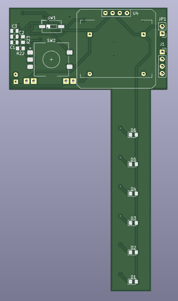
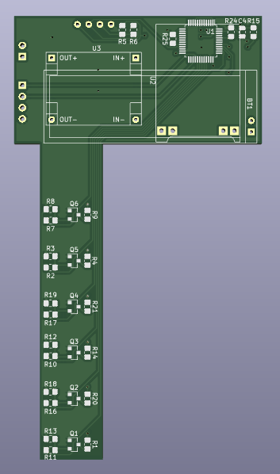

# OTunerPCB
Schematics and PCB for the OTuner - optical guitar tuner, which uses stroboscopic effect instead of sound.

The project was done as a part of Principles of Computer Organization course at UCU in association with mentors from Renesas company.

The ```main``` branch contains files that ended up as a final version for the student project and the ```dev``` branch contains files for future development as a standalone project.

  
  
  
