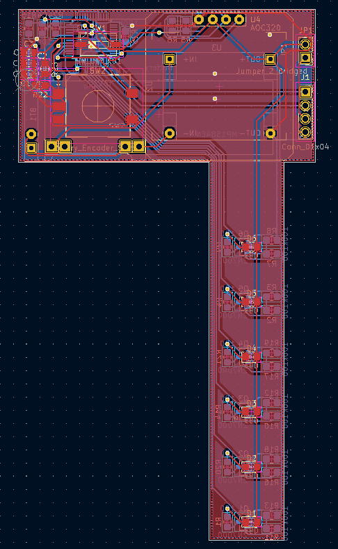

# OTunerPCB
Schematics and PCB for the OTuner - optical guitar tuner, which uses stroboscopic effect instead of sound.

The project was done as a part of Principles of Computer Organization course at UCU in association with mentors from Renesas company.

The ```main``` branch contains the version that ended up as a final version for the student project, but the ```dev``` branch contains files for the future development as a standalone project.

  

  
